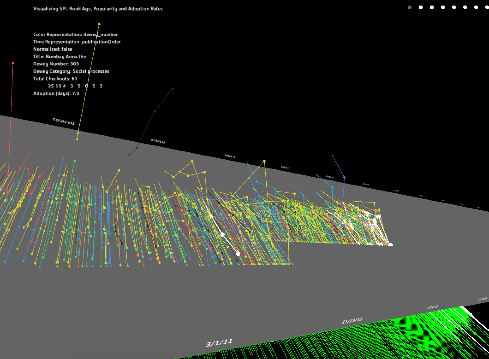
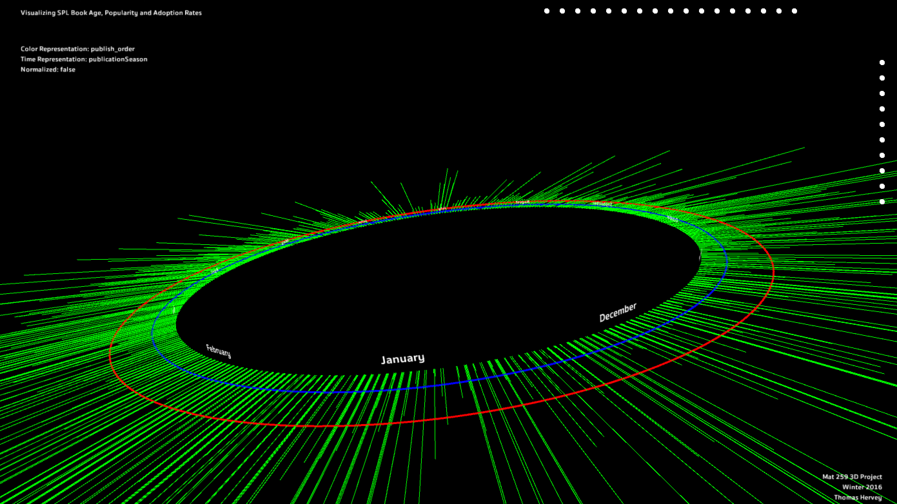

# Seattle-public-library-visualization

To use, download entire project, make sure you have Processing3 installed, and run the assignment3.pde file.

Final product for my MAT259 algorithmic visualization course displaying a 3D interactive 3-axis graph comparing the publication date, time until adoption, and checkout count. Data publication gathered from Amazon and Seattle Public Library.
Click, drag, and zoom (sensitive) to change the camera orientation. Using your keyboard, you can manipulate what is displayed. 
- "1", "2", "3" change visualization mode ("4" exagerates Y axis) ("3" "draws" publications in order)
- "6","7" (-1, -5),"8", and "9" (+1, +5) move the highlighted element to give further detail on a publication (toggle on/off with "0")
- Press "Q" through "T" and "U" through "P" to adjust the displayed range
- Play with other keys to see what you can find!

For more information, please see my [part1](http://vislab.mat.ucsb.edu/2016/p1/Thomas_Hervey/index.html), [part2](http://vislab.mat.ucsb.edu/2016/p2/Thomas_Hervey/index.html), and [part3](http://vislab.mat.ucsb.edu/2016/p3/Thomas_Hervey/index.html) deliverables 

##Sample linear graph displaying a timeline.

##Sample radial graph displaying months of the year.

